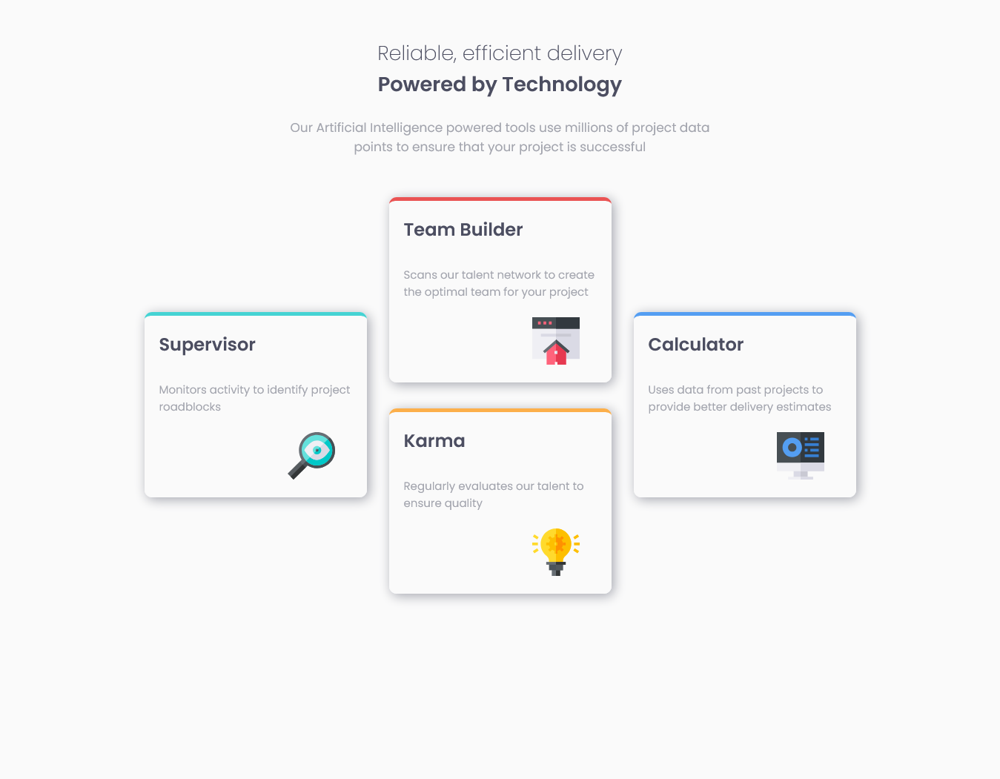

# Frontend Mentor - Four card feature section

Esta vez realizamos un challenge con conocimientos elementales a la hora de
posicionar elementos de una maneras mas compleja.

### Captura de Pantalla

### Hecho con

- HTML
- CSS
- JS
- Mobile-first workflow
- CSS Grid

## Author

- Portafolio - [portafolio]()
- Front End Mentor -
  [@oscar84-spec](https://www.frontendmentor.io/profile/oscar84-spec)
- Linkedin - [Linkedin](https://www.linkedin.com/in/oscar-hdz202/)
