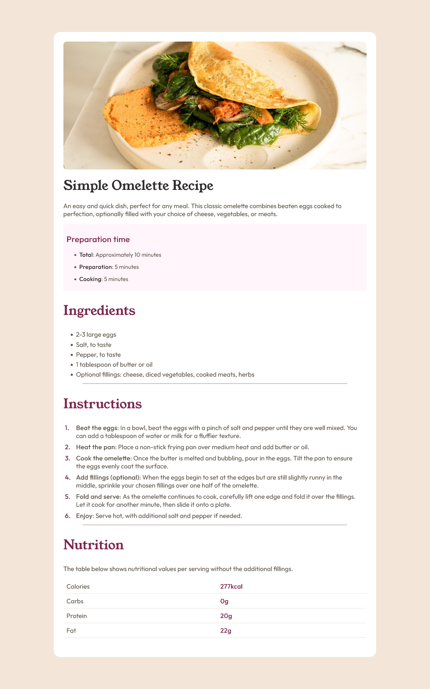

# Front End Mentor Challenge Recipe page

Esta vez en este reto, hemos hecho un página de una receta de comida,
donde ponemos en práctica y nos concentramos en la semántica del HTML.

## Built with

- HTML
- CSS

### Author: Oscar Hernández - Jun 2024

### Contact me:

- 
- 
